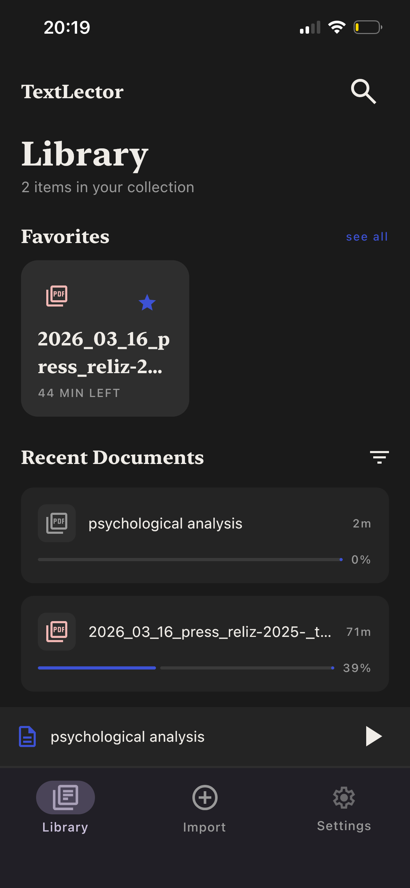
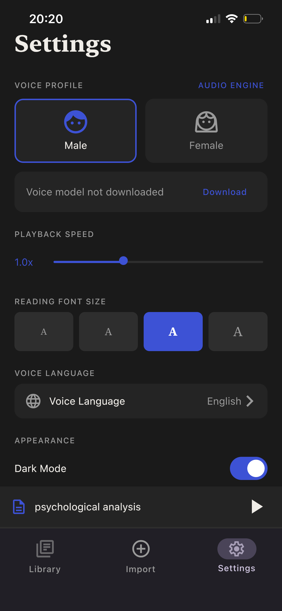

# TextLector

A free, offline text-to-speech reader for Android and iOS, built with Kotlin Multiplatform and Compose Multiplatform.

> Positioned as an open-source alternative to Speechify — no subscriptions, no internet required, no data leaves your device.
 
---

## Screenshots

<p float="left">
  
  
  
</p>

---

## Features

- **Import** — PDF, TXT, or paste text manually
- **Offline TTS** — native system voices on both platforms; high-quality neural Piper voices via sherpa-onnx (Android, iOS)
- **Paragraph highlighting** — current paragraph is highlighted in sync with playback
- **Reading progress** — app remembers where you stopped in every document
- **Library** — manage documents, mark favorites, sort by date
- **Adjustable playback** — speed control (0.5x–2.0x), voice gender, language, font size
---

## TTS Architecture

TextLector uses a two-tier TTS system:

**Phase 1 — Native TTS (default)**
Android `TextToSpeech` and iOS `AVSpeechSynthesizer` — available immediately, no downloads.

**Phase 2 — Neural TTS via Piper / sherpa-onnx**
[sherpa-onnx](https://github.com/k2-fsa/sherpa-onnx) bundles a pre-compiled ONNX Runtime and eSpeak-NG, which means no manual C++ compilation or model conversion. Piper VITS models (~63MB each) are downloaded on demand from HuggingFace and stored locally.

Supported voices:
| Voice | Language | Gender |
|---|---|---|
| Ruslan | Russian | Male |
| Irina | Russian | Female |
| Ryan | English | Male |
| Lessac | English | Female |

The switch between native and neural TTS happens at runtime through `SwitchableTtsEngine` — no app restart required.

**Why sherpa-onnx over self-built Piper:**
Building Piper from source requires cross-compiling eSpeak-NG and ONNX Runtime for each target (arm64-v8a, x86_64, iOS arm64). sherpa-onnx ships pre-built XCFramework and AAR with all native libs included, reducing integration to a dependency declaration.
 
---

## Tech Stack

| Layer | Technology |
|---|---|
| UI | Compose Multiplatform |
| Architecture | MVI + ViewModel (commonMain) |
| DI | Koin Multiplatform |
| Navigation | Navigation Compose CMP (Nav3, typesafe routes) |
| Database | SQLDelight 2.x |
| Preferences | multiplatform-settings |
| File I/O | okio |
| Neural TTS | sherpa-onnx + Piper VITS models |
| PDF (Android) | PdfBox-Android |
| PDF (iOS) | PDFKit + Vision OCR fallback |
 
---

## Project Structure

```
composeApp/
├── commonMain/         # shared UI, ViewModels, domain, data
│   ├── domain/         # models, repository interfaces, use cases
│   ├── data/           # SQLDelight, repository implementations
│   ├── ui/             # Compose screens and components
│   └── platform/       # expect declarations (TTS, FileReader, etc.)
├── androidMain/        # Android actuals + sherpa-onnx engine
├── iosMain/            # iOS actuals
└── jvmMain/            # Desktop (planned)
 
iosApp/
├── TTS/                # IosSherpaEngine, SherpaOnnxTtsBridge
├── PDF/                # PdfTextExtractor, IosPdfPageExtractor
└── Utils/              # IosFileDownloader, IosTarExtractor
```
 
---

## Building

### Prerequisites

- Android Studio Meerkat or later
- Xcode 15+
- JDK 17+
- Kotlin 2.0+
### Android

```bash
./gradlew :composeApp:assembleDebug
```

### iOS

Open `iosApp/iosApp.xcodeproj` in Xcode and run on a simulator or device.

> The sherpa-onnx XCFramework is included via CocoaPods / local framework — no additional setup required.

### Shared KMP module

```bash
./gradlew :composeApp:compileKotlinAndroid
./gradlew :composeApp:iosArm64MainKlibrary
```
 
---

## Roadmap

- [ ] URL import
- [ ] Camera / OCR import
- [ ] JVM / Desktop support
- [ ] Background playback (MediaSession / AVAudioSession)
- [ ] iOS sherpa-onnx neural TTS (Phase 3)
---

## License

MIT